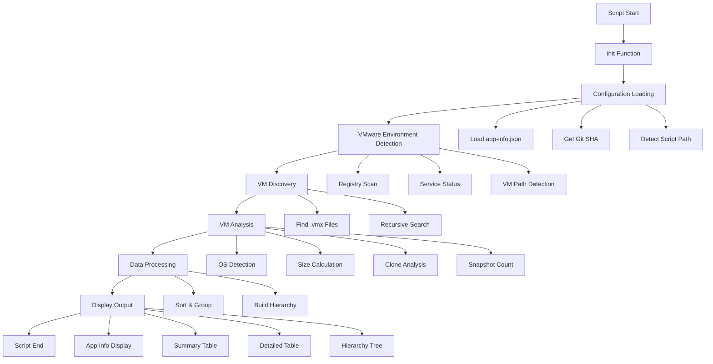
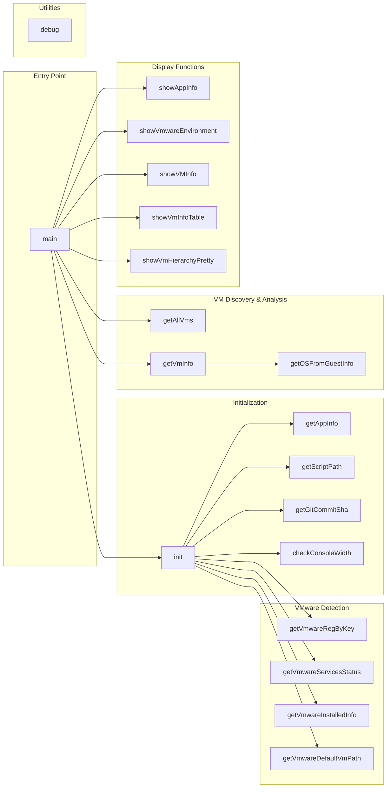
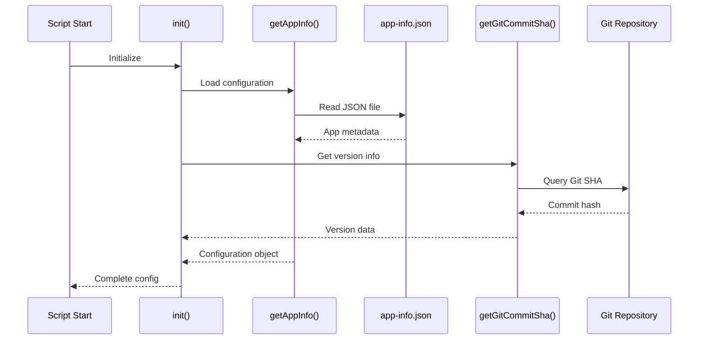
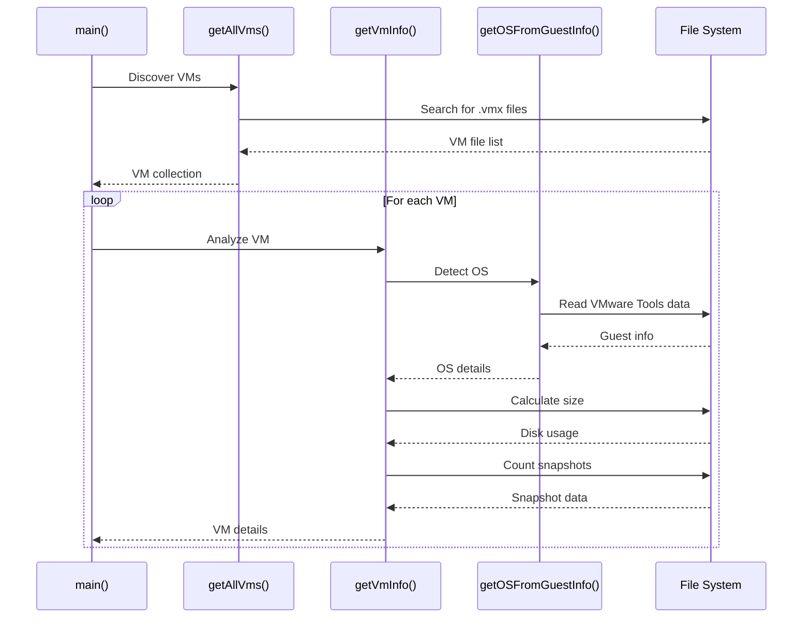
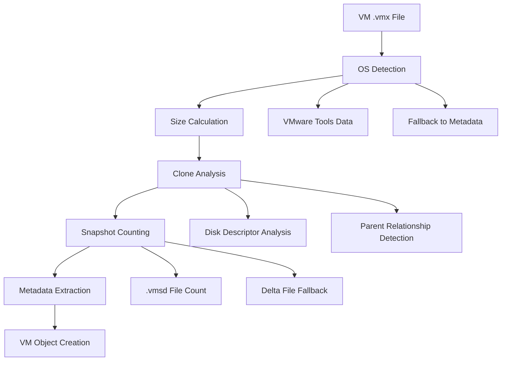
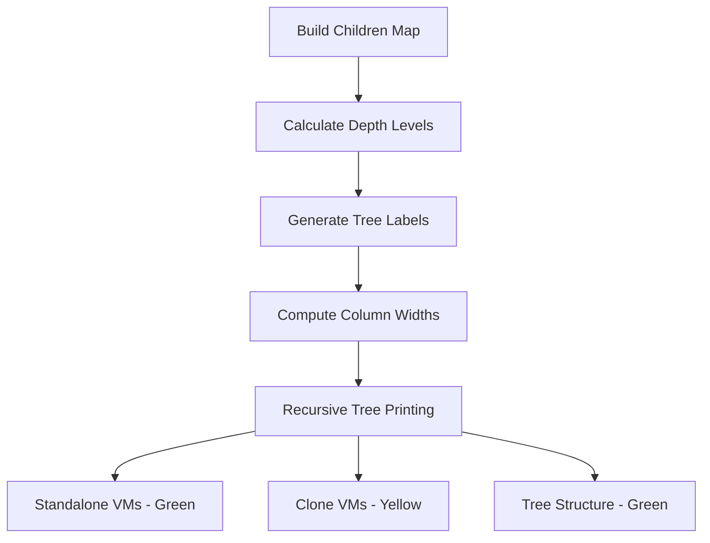

# VM-Inventory Architecture Documentation

## Overview
This document provides a technical deep-dive into the VM-Inventory PowerShell script architecture, explaining how the code works, function relationships, and data flow.

## Script Flow Diagram



## Function Architecture

### Core Functions Map



## Data Flow Architecture

### Configuration Data Flow



### VM Discovery & Analysis Flow



## Function Details

### 1. Initialization Functions

#### `init()`
**Purpose**: Master initialization function that sets up the entire runtime environment.

**Key Responsibilities**:
- Console width validation
- User context detection
- VMware environment discovery
- Configuration loading
- OS mapping setup

**Returns**: Configuration object with all runtime settings

#### `getAppInfo()`
**Purpose**: Loads application metadata from JSON configuration.

**Data Sources**:
- `app-info.json` file
- Fallback hardcoded values

**Key Features**:
- Debug mode detection
- Display preferences
- Version and build information

### 2. VMware Detection Functions

#### `getVmwareRegByKey()`
**Purpose**: Registry scanner for VMware installation details.

**Registry Paths Searched**:
```
HKLM:\SOFTWARE\VMware, Inc.
HKLM:\SOFTWARE\WOW6432Node\VMware, Inc.
HKLM:\SOFTWARE\VMware, Inc.\VMware Workstation
HKLM:\SOFTWARE\WOW6432Node\VMware, Inc.\VMware Workstation
```

#### `getVmwareDefaultVmPath()`
**Purpose**: Extracts default VM storage location from VMware preferences.

**File Location**: `%APPDATA%\VMware\preferences.ini`
**Key**: `prefvmx.defaultVMPath`

### 3. VM Analysis Functions

#### `getVmInfo()`
**Purpose**: Core VM analysis function that extracts comprehensive VM metadata.

**Analysis Pipeline**:


#### `getOSFromGuestInfo()`
**Purpose**: Advanced OS detection using VMware Tools guest information.

**Detection Strategy**:
1. Parse `guestInfo.detailed.data` from .vmx
2. Extract `prettyName` field
3. Clean up verbose build information
4. Return human-readable OS name

### 4. Display Functions

#### `showVmHierarchyPretty()`
**Purpose**: Creates visual tree representation of VM clone relationships.

**Tree Building Algorithm**:


**Tree Characters**:
- `+-- ` for standalone VMs (root level)
- `|   ` for continuation lines
- `|── ` for clone branches

#### `showVmInfoTable()`
**Purpose**: Displays comprehensive VM data in tabular format with color coding.

**Table Features**:
- Dynamic column width calculation
- Color-coded rows (Green for standalone, Yellow for clones)
- Cyan highlighting for snapshot counts
- Group separation with blank lines

## Data Structures

### Configuration Object
```powershell
[PSCustomObject]@{
    # Path Information
    ScriptPath       = String
    Root             = String
    RunningFrom      = String
    
    # Application Metadata  
    AppInfo          = AppInfoObject
    GitSha           = GitShaObject
    
    # VMware Environment
    vmDesktopCore    = String
    vmProductVersion = String
    vmInstallPath    = String
    defaultVmPath    = String
    vmServices       = String
    vmInstalledInfo  = VmwareInstallObject
    
    # Runtime Settings
    ShowSummaryTable = Boolean
    OSMap            = Hashtable
    
    # User Context
    RunningUser      = String
    RunningMachine   = String
    RunningUsername  = String
    RunningDomain    = String
    IsDomainUser     = Boolean
}
```

### VM Information Object
```powershell
[PSCustomObject]@{
    Name           = String      # VM display name
    VmType         = String      # "Standalone" or "Clone"
    Parent         = String      # Parent VM name (for clones)
    ParentDisk     = String      # Parent disk file
    Descriptor     = String      # VMDK descriptor file
    Path           = String      # VM directory path
    VmxConfig      = String      # .vmx filename
    OS             = String      # Detected operating system
    Size           = String      # Human-readable size
    SizeBytes      = Integer     # Size in bytes
    Created        = String      # Creation timestamp
    SnapshotCount  = Integer     # Number of snapshots
    Standalone     = Integer     # 1 if standalone, 0 if clone
    Clone          = Integer     # 1 if clone, 0 if standalone
}
```

## Logging System

The script includes a centralized logging system with multiple output levels and flexible configuration.

### Log Levels (Priority-Based Filtering)
- **DEBUG** (0): Detailed diagnostic information for troubleshooting
- **INFO** (1): General informational messages
- **WARN** (2): Warning messages for potential issues
- **ERROR** (3): Error messages for failures

### Logging Functions
- **Core**: `_log()` - Private function handling all logging logic
- **Wrappers**: `logDebug()`, `logInfo()`, `logWarn()`, `logError()` - Public API
- **Configuration**: `initializeLogging()` - Sets up logging system
- **Helpers**: `hideMethodName()`, `showMethodName()` - Toggle method name display

### Log Output Format
```
2025-01-23 14:30:15 [DEBUG] [    getVmInfo:123] Processing VM: Windows-10-Pro
2025-01-23 14:30:15 [INFO ] [ 456] Total VMs: 15
2025-01-23 14:30:15 [WARN ] [ 789] Console width is too small
2025-01-23 14:30:15 [ERROR] [1234] VMware Workstation is NOT installed
```

**Format Components**:
- Timestamp: `yyyy-MM-dd HH:mm:ss`
- Log Level: `[LEVEL]` (padded to 5 characters)
- Line Number: `[####]` (padded to 4 digits)
- Method Name (optional): `[methodName:line]` (padded to 25 characters)
- Message: Actual log content

### Color Coding
- **DEBUG**: `DarkGray` - Diagnostic details
- **INFO**: `Green` - Normal operations
- **WARN**: `Yellow` - Warnings
- **ERROR**: `Red` - Errors
- **Custom**: Messages can override default color

### Configuration
Logging is configured via `app-info.json`:
```json
{
  "logging": {
    "enableFileLogging": false,
    "logLevel": "INFO",
    "logFilePath": ".\\logs\\VM-Inventory_{timestamp}.log",
    "includeMethodName": true
  }
}
```

### File Logging
When enabled, logs are written to timestamped files in the `logs/` directory with identical format to console output (minus colors).

## Performance Considerations

### File System Operations
- **Recursive VM Discovery**: Uses `Get-ChildItem -Recurse` for comprehensive scanning
- **Size Calculation**: Aggregates all files in VM directory
- **Snapshot Detection**: Prioritizes .vmsd files over file pattern matching

### Memory Usage
- **Streaming Processing**: VMs processed individually, not batch-loaded
- **Selective Data Loading**: Only reads necessary portions of large files
- **Object Reuse**: Configuration object passed by reference

### Error Handling Strategy
- **Graceful Degradation**: Script continues even if individual VMs fail
- **Informative Fallbacks**: Default values when detection fails
- **User Feedback**: Clear error messages and warnings

## Extension Points

### Adding New OS Detection
1. Extend the `$osMap` hashtable in `init()`
2. Add new patterns to `getOSFromGuestInfo()`
3. Update fallback logic in `getVmInfo()`

### Adding New Display Formats
1. Create new function following naming pattern `show*`
2. Add configuration flag to `app-info.json`
3. Integrate into main execution flow

### Adding New VM Analysis Features
1. Extend the VM object structure
2. Add analysis logic to `getVmInfo()`
3. Update display functions to show new data

## Dependencies and Requirements

### PowerShell Requirements
- **Version**: 5.1 or higher
- **Execution Policy**: Must allow script execution
- **Modules**: Uses built-in cmdlets only

### External Dependencies
- **VMware Workstation**: Must be installed for VM path detection
- **File System Access**: Read permissions to VM directories
- **Registry Access**: For VMware installation detection

### Optional Dependencies
- **Git**: For commit SHA detection and build automation
- **app-info.json**: For configuration customization

## Troubleshooting Guide

### Common Issues
1. **No VMs Found**: Check VMware default path in preferences.ini
2. **Permission Denied**: Run PowerShell as Administrator
3. **Console Width Warnings**: Resize terminal or use classic console
4. **Missing OS Detection**: Ensure VMware Tools are installed in VMs

### Debug Mode Activation
Enable detailed logging by setting log level to DEBUG in app-info.json:
```json
{
  "logging": {
    "logLevel": "DEBUG",
    "enableFileLogging": true,
    "includeMethodName": true
  }
}
```

This documentation provides a comprehensive technical reference for understanding, maintaining, and extending the VM-Inventory script architecture.